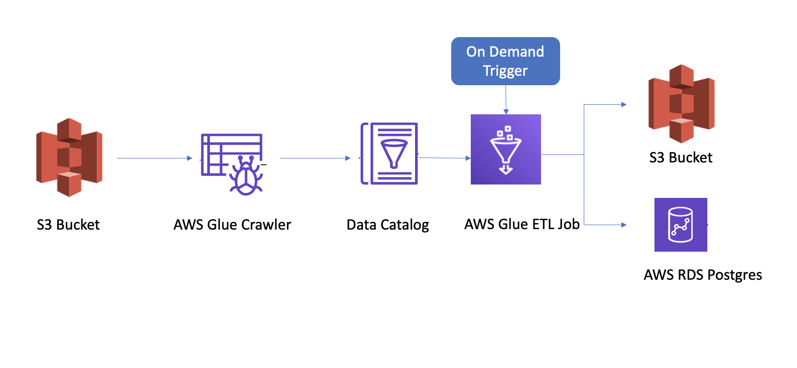

# PedestrianCountAnalysis
The application calculates -  
1. Top 10 (most pedestrians) locations by day
2. Top 10 (most pedestrians) locations by month

The source data is located in the data folder.

# Appoach 
The application performs an ETL operation as explained below - \
Step 1 - It takes the data from S3 bucket named - step-count-data-bucket-sh\
Step 2 - It creates a data catalog by running a crawler - stepper-crawler-sh\
Step 3 - It triggers an AWS glue Etl job with job name - count-steps-job-sh\
Step 4 - It puts the transformed data in a csv format to another S3 bucket - step-count-output-bucket-sh\
Step 5 - It puts the transformed data in postgres databases - rds-sh with datbase name MyDB

# Architecture


# Pre-Requisites
```sh
- AWS Credentials
- Terraform
- python3.x
```

# Data Files - 
## **!! _This is important_ !!**
Download the Count file from  -  
[Pedestrian-Counting-System-Monthly-Counts](https://data.melbourne.vic.gov.au/Transport/Pedestrian-Counting-System-Monthly-counts-per-hour/b2ak-trbp)

Download the Sensor Data from  -   
[Pedestrian-Counting-System-Sensor](https://data.melbourne.vic.gov.au/Transport/Pedestrian-Counting-System-Sensor-Locations/h57g-5234)

Replace the files the data folder of the project.  
Note - Please don't change the file names
# Setup - 
1. Configure Aws Credentials - 
```aws
aws configure  
```  

2. Install terraform  - 
    [How to install terraform](https://learn.hashicorp.com/tutorials/terraform/install-cli)

3. Create virtual environment in the project root folder(optional) -   
```virtual
python3 -m venv .venv
```

# Run - 
1. Initiate terraform in the project root folder -
```tr
terraform init
```

2. Deploy the infra to aws  - 
```tr
terraform apply
```
Type 'yes' when prompted

3. Activate virtual environment -
```virt
source .venv/bin/activate
```
4. Install dependancies - 
```pip
pip install -r requirements.txt
```

5. Run the main.py script - 
```main
python main.py 
```

# Output
1. The Output CSVs are stored in S3 - 'step-count-output-bucket-sh'
2. In postgres 'rds-sh' with datbase name 'MyDB'

# Clean-Up
For cleaning up resources created follow these two steps - 

1. Run CleanBuckets.py
```clean
python CleanBuckets.py
```
2. Clean Infra from AWS - 
```clean
terraform destroy
```
Type 'yes' when prompted
